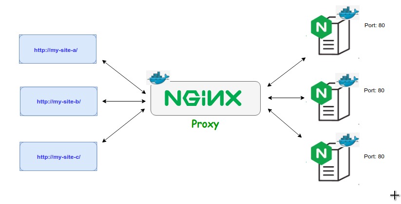

## NGINX proxy server for docker containers.

This is a simple nginx proxy server setup to map web apps running independently on separate containers.



For instance, if we are running more than one web apps on docker containers then obviously, we will not be able to expose same external port for the app.

```config
for example:
- http://my-site-a/
- http://my-site-b/
```

By using, nginx proxy server we can request respective servers irrespective to the exposed port to host.

### Network

Docker containers need to be in same network in order to identify each other. Therefore, we will have to create a bridge network and assign that network to every docker container we wish to put in the proxy network.

```sh
docker network create -d bridge nginx-proxy
```

Include, network config in docker compose file, for example:

```yaml
version: '3.5'
services:
 site_a:
  container_name: mysite_a
   image: nginx:alpine
   networks:
    - nginx-proxy
networks:
  nginx-proxy:
    name: nginx-proxy
```

### NGINX config


#### [upstream directive](http://nginx.org/en/docs/http/ngx_http_upstream_module.html#upstream)

```config
    upstream site_a { server site_a; }
```
or,
```config
    upstream site_a { server site_a:3000; }
    upstream site_b { server site_b:3000; }
```

Here `site_a` and `site_b` is name of the running docker containers and `3000` is the port exposed in that container.


### [server directive](http://nginx.org/en/docs/http/ngx_http_upstream_module.html#server)

### Typical proxy server config.

So, typical proxy server config looks like as below.

```config
upstream site_a { server site_a:3000; }
server {
    listen 80;
    server_name my-site-a;
    location / {
        proxy_pass http://site_a;
        proxy_redirect off;
    }
}

upstream site_b { server site_b:3000; }
server {
    listen 80;
    server_name my-site-b;
    location / {
        proxy_pass http://site_b;
        proxy_redirect off;
    }
}
```

### Test

Add hostnames entries in your host machine's `/etc/hosts` file.
```
127.0.0.1 my-site-a
127.0.0.1 my-site-b
```

This repo consists of a working proxy server and sample web app `site_a` and `site_b`.

Steps:

1. `docker-compose -f site-A/docker-compose.yml up --build -d` : Spin up `site_a` container.
2. `docker-compose -f site-B/docker-compose.yml up --build -d` : Spin up `site_b` container.
3. `docker-compose -f proxy/docker-compose.yml up --build -d` : Spins up the `the_proxy` container.


Curl request from host machine would look like below.

```config
➜ curl -I my-site-a
HTTP/1.1 200 OK
Server: nginx/1.15.8
Date: Sun, 27 Jan 2019 12:01:02 GMT
Content-Type: text/plain
Content-Length: 18
Connection: keep-alive
```
